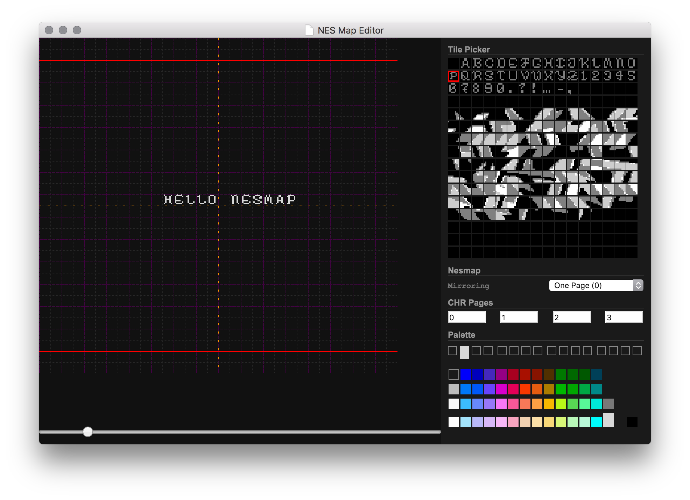

# NESMAP Editor

> NOTE: This project is written like crap. I just needed it done for a game I'm designing.

This is a "universal" editor for NES tile maps (nametables).

It operates on a JSON file called a `.nesmap` file, which can be converted to whatever binary data you need it in.

It supports 4 banks for CHR swapping (or if you only use one static CHR bank, use `0, 1, 2, 3`).

# Usage

> TODO
